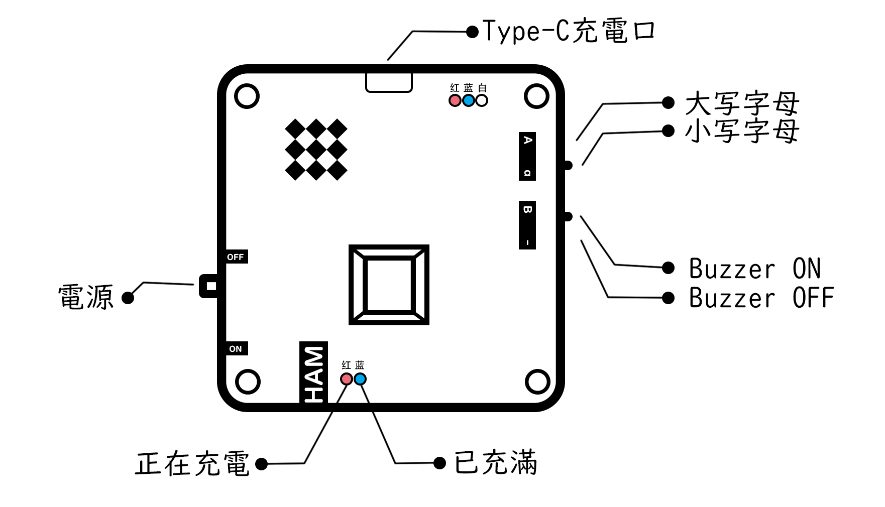

# HAMKey-Lite

`HAMKey`是一个与摩斯码密切相关的键盘项目。旨在为业余无线电爱好者和对摩斯码感兴趣的人群提供一个便利的输入外设。

本分支为`HAMKey-Lite`的固件仓库。

## 编译与烧录

### 编译

编译本项目必须的物料如下：

- GNU make
- armgcc
- nRF52 SDK 17.1.0

在`makefile`中配置好SDK路径。然后在nRF52 SDK中配置好`armgcc`的路径。运行`make`即可完成编译。

### 烧录

烧录需要的物料如下：

- openOCD
- cmsis-dap仿真器

在编译通过后，连接上目标板，运行`make flash`即可烧录。

## 功能说明

本键盘有物理开关`3`个，物理按键`1`个，Type-C充电接口`1`个。

### 状态灯

本键盘有`5`个状态灯，下方两个状态灯为充电状态指示灯：

- 红灯表示正在充电
- 蓝灯表示电已充满

上方三个状态灯分别为红蓝白三色：

- 开机时，三个状态灯会全亮一次
- 蓝牙广播，蓝灯闪烁。蓝牙连接，蓝灯熄灭
- 识别到摩斯码的`点`输入时，红灯闪烁，识别到摩斯码的`划`输入时，蓝灯闪烁，字符发送时，白灯闪烁
- 电量过低时，红灯一直闪烁

### 蜂鸣器

开机时，蜂鸣器会鸣响字符`+`的摩斯码，同时也作为一个直观的摩斯码时间节奏。

按动物理按键时，蜂鸣器会随按键鸣响。

长按时，蜂鸣器最多连续鸣响`1`秒后会自动静音。

### 开关

当蜂鸣器开关置于关闭的位置时，功能性的蜂鸣器鸣响均会静音。

当大小写开关置于大写的位置时，输入英文字母`a-z`时，会自动附加`Shift`键，变成大写字母`A-Z`.

## 额外功能说明

本键盘内置了一个办公模式。

- 长按按键`2`秒，白灯将会亮`1`秒，表示进入了办公模式。在办公模式下：
  - 输入摩斯码的`划`将会发送`ctrl+c`实现复制功能，输入摩斯码的`点`将会发送`ctrl+v`实现粘贴功能。
  - 长按按键`2`秒，蓝灯将会亮`1`秒，表示退出办公模式。
- 在任意模式下，连续`15`分钟无按键将会进入休眠状态，按下按键即可唤醒。

## 关联项目

- 父仓库：[HAMKey](https://github.com/HelloWorksGroup/HAM-Key)
- 3D设计：[HAMKey-Lite-3D](https://github.com/Nigh/HAMKey-Lite-3D)
- layout：[HAMKey-Lite-layout](https://github.com/Nigh/HAMKey-Lite-layout)

